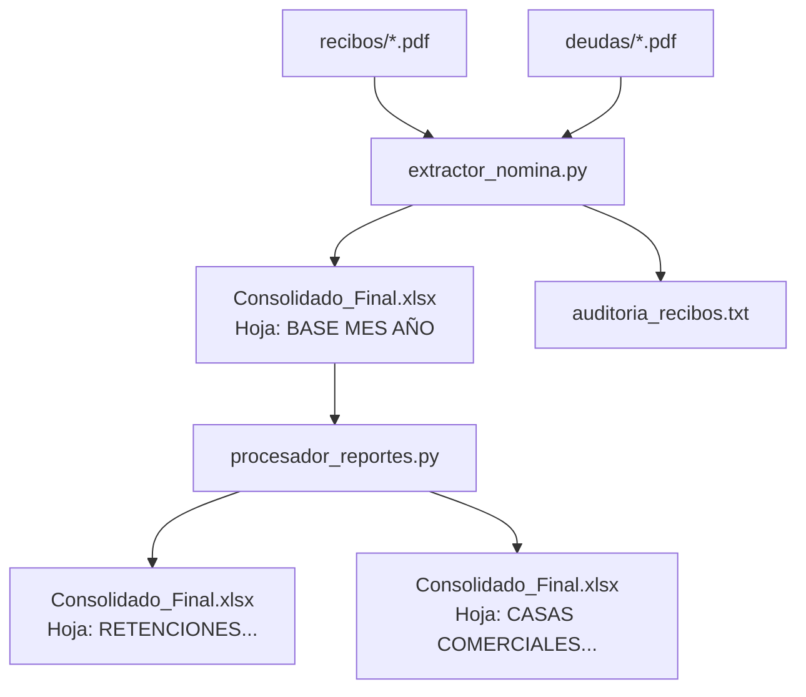
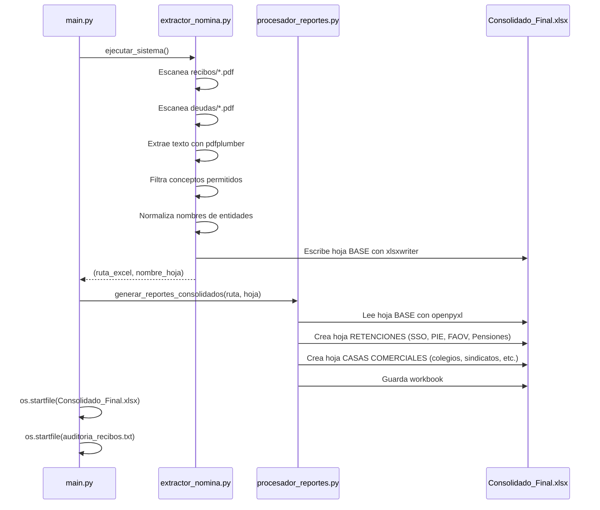

# Sistema de Procesamiento de Recibos de Nómina — CORPOSALUD

Sistema automatizado para extraer deducciones de recibos de nómina en PDF, consolidarlas en un archivo Excel y generar reportes agrupados por retenciones de ley y casas comerciales.

---

## Arquitectura general



## Flujo de datos



---

## Estructura de archivos

```
recibos/
├── main.py                  # Punto de entrada del sistema
├── extractor_nomina.py      # Motor de extracción de datos PDF → Excel
├── procesador_reportes.py   # Generación de reportes agrupados
├── .gitignore               # Ignora archivos *.pdf
└── README.md                # Este documento
```

### Archivos externos usados

| Archivo | Propósito |
|---|---|
| `recibos/*.pdf` | Recibos de nómina normales |
| `deudas/*.pdf` | Recibos de deudas |
| `Consolidado_Final.xlsx` | Archivo Excel de salida |
| `auditoria_recibos.txt` | Log de auditoría del proceso |

---

## Componentes

### 1. `main.py`

Punto de entrada. Orquesta el flujo completo:

1. Llama a `extractor_nomina.ejecutar_sistema()` para extraer datos de PDFs y generar el Excel base.
2. Si tiene éxito, llama a `procesador_reportes.generar_reportes_consolidados()` para crear las hojas de reporte.
3. Abre los archivos generados con la aplicación predeterminada del sistema.
4. Muestra cuadros de diálogo con `tkinter.messagebox`.

**Nota:** Usa `os.startfile()` que solo funciona en Windows. En Linux/Mac fallará.

### 2. `extractor_nomina.py`

Motor principal del sistema. Contiene toda la lógica de extracción.

#### Funciones

| Función | Descripción |
|---|---|
| `registrar_auditoria(mensaje)` | Escribe una entrada con timestamp en `auditoria_recibos.txt` |
| `obtener_nombre_hoja_base()` | Genera el nombre de la hoja Excel: `"BASE MES AÑO"` (ej. `BASE JUNIO 2026`) |
| `limpiar_monto_estandar(texto)` | Convierte un string de monto (ej. `"1.234,56"` o `"1,234.56"`) a `float`. Maneja formatos venezolanos y americanos. |
| `transformar_y_filtrar(linea)` | Busca conceptos de deducción en una línea de texto. Usa **coincidencia por substring con selección del candidato más largo** para evitar falsos positivos. Ver diccionario completo más abajo. |
| `normalizar_entidad(texto)` | Identifica la entidad (hospital, DMS, ambulatorio) a partir del texto completo de la primera página del PDF. Usa **selección del candidato más largo** para priorizar nombres específicos sobre membretes genéricos. |
| `extraer_datos_de_carpeta(ruta, entidades_dict, entidades_encontradas, es_deuda)` | Escanea todos los PDFs de una carpeta, extrae concepto, entidad, número de recibo y monto de cada línea de deducción. |
| `ejecutar_sistema()` | Orquesta la extracción completa: escanea `recibos/` y `deudas/`, consolida en Excel con `xlsxwriter`, retorna la ruta y el nombre de la hoja. |

#### Conceptos de deducción procesados

Cada concepto tiene un nombre y un código contable.

**Retenciones de Ley**

| Concepto | Código | Tipo |
|---|---|---|
| Ley S.S.O. (4%) | 210 | Normal |
| S.S.O. (DEUDA) | 210.1.1 | Deuda |
| Ley P.I.E. | 244 | Normal |
| P.I.E. (DEUDA) | 244.2 | Deuda |
| Fondo de Ahorro Obligatorio para la Vivienda (FAOV) | 245 | Normal |
| FAOV (DEUDA) | 245.3 | Deuda |
| Fondo Pensiones (Jubilación) | 301 | Normal |
| Fondo Pensiones Jubilación (DEUDA) | 301.2 | Deuda |

**Colegios Profesionales**

| Concepto | Código |
|---|---|
| Colegio Bioanalista | 255 |
| Colegio Nutric. y Diet. Vzla | 286 |
| Colegio Enfermeras | 224 |
| Colegio de Enfermeras Estado Carabobo | 967 |
| Colegio de Enfermera Edo. Miranda | 603 |

**Días No Laborados**

| Concepto | Código |
|---|---|
| No Ley Desc. Día(s) No Laborado(s) | 179 |
| Desc. Día(s) No Laborado(s) | 179 |

**Cajas de Ahorro**

| Concepto | Código |
|---|---|
| Caja de Ahorro CAEMINSA | 238 |
| Préstamo Caja de Ahorro | 223 |

**Sindicatos y Sociedades**

| Concepto | Código |
|---|---|
| Sindicato Único de Trab. de la Salud y S | 233 |
| Sindicato OSBESS Aragua | 978 |
| Sociedad Anestesiólogos | 257 |
| SINBOPROENF | 321 |
| SUNEP-SAS | 213 |
| FENASISTRASALUD | 513 |
| SISTRASALUD | 583 |
| SAPTRASEZ | 964 |
| SITRASSS-MIRANDA / SISTRASSS MIRANDA | 581 |
| ASUNAJUPENSAPROSO | 799 |

**Otros**

| Concepto | Código |
|---|---|
| CAHORMINSAS | 212 |
| No Ley CAHORMINSAS | 212 |
| Servicios Funerarios CAHORMINSAS | 269 |
| Delegación Regional INPRENFERMERA Aragua | 370 |
| Tribunal de Protección de Niños, Niñas | 807 |
| Tribunal (Permanente) | 215 |

#### Entidades reconocidas (MAPEO_CENTROS)

| Nombre normalizado | Variaciones reconocidas |
|---|---|
| SAANA | S.A.A.N.A., SAANA |
| SAGER | S.A.G.E.R., SAGER |
| Ambulatorio de Turmero | AMB. DE TURMERO, AMBULATORIO DE TURMERO |
| Sala de Parto de Turmero | SALA DE PARTO DE TURMERO |
| Sociedad Civil Hospital del Sur | HOSPITAL DEL SUR, SOCIEDAD CIVIL HOSPITAL DEL SUR, SOCIEDAD CIVIL |
| D.M.S Camatagua | D.M.S. CAMATAGUA, D.M.S CAMATAGUA-URDANETA |
| Hospital Central de Maracay | S.A. HOSPITAL CENTRAL DE MARACAY |
| Hospital José María Benítez | S.A. HOSPITAL JOSE MARIA BENITEZ |
| Hospital José María Vargas | HOSPITAL JOSE MARIA VARGAS |
| Hospital José Rangel | HOSPITAL JOSE RANGEL |
| Hospital Las Tejerías | HOSPITAL LAS TEJERIAS |
| Hospital Nuestra Señora de la Caridad | HOSPITAL NUESTRA SEÑORA DE LA CARIDAD |
| Clínica Psiquiátrica de Maracay | CLINICA PSIQUIATRICA DE MARACAY |
| 14 D.M.S. (Girardot, Mariño, Ribas, Sucre, Zamora, Libertador, Santos Michelena, Tovar, Revenga, San Casimiro, Bolívar, Francisco Linares Alcántara, Mario Briceño Iragorri) | D.M.S. respectivo |
| Ambulatorios | AMB. PALO NEGRO, AMB. LA CANDELARIA |
| Servicios Centrales | SERVICIOS CENTRALES |
| Corporación de Salud del Estado Aragua | CORPORACION DE SALUD DEL ESTADO ARAGUA |

### 3. `procesador_reportes.py`

Genera hojas de reporte adicionales en el Excel consolidado usando `openpyxl`.

#### Reportes generados

**Hoja: `RETENCIONES {MES} {AÑO}`**

Agrupa las deducciones de ley con sus subtotales por entidad:

| Grupo | Búsqueda | Nombre normal | Nombre deuda |
|---|---|---|---|
| SSO | S.S.O. | S.S.O. (4%) 210 | S.S.O. (DEUDA) 210.1.1 |
| PIE | PERDIDA | P.I.E. 244 | P.I.E. (DEUDA) 244.2 |
| Pensiones | PENSION | Fondo Pensiones (Jubilación) 301 | Fondo Pensiones Jubilación (DEUDA) 301.2 |
| FAOV | VIV | FAOV 245 | FAOV (DEUDA) 245.3 |

**Hoja: `CASAS COMERCIALES {MES} {AÑO}`**

Agrupa los descuentos gremiales y sindicales con subtotales por entidad. Incluye colegios, sindicatos, cajas de ahorro, tribunales, y otros conceptos.

---

## Estrategia de matching

El sistema utiliza **búsqueda por substring** en todos los niveles de identificación:

1. **Entidades** (`normalizar_entidad`): busca variaciones del nombre dentro del texto completo de la página 1 del PDF. Selecciona el **nombre normalizado más largo** entre todos los candidatos encontrados, priorizando así la coincidencia más específica.
2. **Conceptos** (`transformar_y_filtrar`): busca nombres de conceptos dentro de cada línea de texto extraída. También selecciona el **código más largo** entre todos los candidatos, evitando falsos positivos como `SISTRASALUD` dentro de `FENASISTRASALUD`.
3. **Reportes** (`procesador_reportes.py`): usa `str.contains` con **word boundaries** (`\b`) para evitar que términos cortos como `VIV` o `DESC` matcheen dentro de otras palabras.

---

## Librerías utilizadas

| Librería | Versión | Uso |
|---|---|---|
| `pdfplumber` | — | Extracción de texto de archivos PDF |
| `pandas` | — | Estructuras de datos (DataFrames) y filtrado |
| `xlsxwriter` | — | Escritura inicial del Excel consolidado (hoja BASE) |
| `openpyxl` | — | Lectura/escritura del Excel para agregar hojas de reporte |
| `tkinter` | (stdlib) | Cuadros de diálogo de éxito/error |
| `re` | (stdlib) | Expresiones regulares para extraer número de recibo y word boundaries |
| `os` | (stdlib) | Operaciones de archivos y rutas |
| `datetime` | (stdlib) | Fechas para nombres de hojas y auditoría |

### Instalación de dependencias

```bash
pip install pdfplumber pandas xlsxwriter openpyxl
```

---

## Uso

```bash
cd recibos/
python main.py
```

### Requisitos previos

1. Colocar los recibos PDF en `recibos/` (nóminas normales) y `deudas/` (deudas).
2. Ejecutar el script.
3. El sistema genera:
   - `Consolidado_Final.xlsx` en la carpeta raíz del proyecto
   - `auditoria_recibos.txt` con el registro detallado del proceso

### Estructura esperada de carpetas

```
CORPOSALUD-DEDUCCIONES/
├── recibos/
│   ├── main.py
│   ├── extractor_nomina.py
│   ├── procesador_reportes.py
│   ├── *.pdf              ← Recibos de nómina
│   └── README.md
├── deudas/
│   └── *.pdf              ← Recibos de deudas
├── config.json
├── casas_comerciales.py
├── casas_comerciales - final.py
├── aportes_patronales/
└── README.md
```

---

## Limitaciones conocidas

- **Solo Windows**: `os.startfile()` no funciona en Linux/macOS.
- **Dependencia de estructura PDF**: asume que el PDF tiene texto seleccionable. PDFs escaneados (imagen) no funcionarán.
- **Substring matching**: aunque se mitigó con selección del candidato más largo y word boundaries, PDFs con texto inesperado pueden generar falsos positivos.
- **Encoding**: se asume UTF-8 para archivos de texto.
- **Formato de montos**: espera formatos venezolanos (`1.234,56`) o americanos (`1,234.56`); formatos mixtos pueden fallar.

---

## Auditoría

Cada ejecución genera `auditoria_recibos.txt` con:

- Fecha y hora de cada operación
- Archivos PDF procesados exitosamente
- Advertencias por recibos sin conceptos relevantes
- Errores de lectura de PDF
- Lista de entidades no encontradas vs. esperadas

---

## Mantenimiento

### Agregar un nuevo concepto de deducción

1. Agregar entrada en `conceptos_permitidos` dentro de `transformar_y_filtrar` en `extractor_nomina.py`.
2. Agregar entrada en `casas_comerciales` en `procesador_reportes.py`.

### Agregar una nueva entidad

1. Agregar entrada en `MAPEO_CENTROS` con el nombre normalizado y sus variaciones en `extractor_nomina.py`.

### Cambiar el orden de precedencia de matching

El sistema usa `max(candidatos, key=len)` — el candidato con el string más largo gana. Para cambiar este comportamiento, modificar la función `normalizar_entidad` o `transformar_y_filtrar`.
